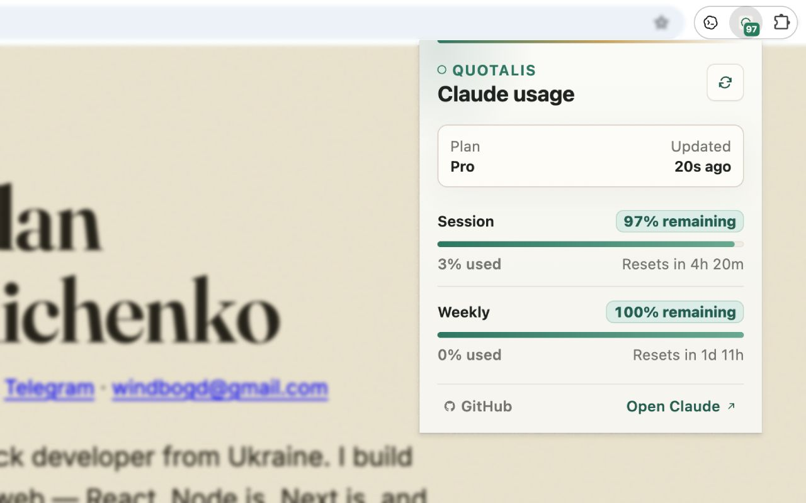

# Quotalis for Claude

Quotalis is a tiny Chrome extension for people who would rather know their Claude.ai usage limits before a conversation disappears into the quota wall.

There are already bigger usage trackers on the market. This one is intentionally not trying to become a dashboard, a productivity platform, or a suspiciously enthusiastic SaaS funnel. I built it for myself because I wanted a quiet meter, a pinned badge, and fewer surprises.



## What it does

- Shows Claude session, weekly, and Opus weekly usage when Claude returns those values.
- Displays reset timing in a compact popup.
- Updates the toolbar badge with remaining session percentage, using clearer caution colors as quota tightens.
- Refreshes locally on a short interval.
- Keeps the interface boring in the best possible way.

## Languages

Quotalis currently supports:

- Chinese (Simplified)
- English
- French
- German
- Indonesian
- Italian
- Japanese
- Portuguese (Brazil)
- Spanish
- Thai
- Ukrainian
- Vietnamese

## Privacy

Quotalis uses the minimum permissions needed for this job:

- `cookies` to read the active Claude.ai browser session.
- `alarms` to refresh usage in the background.
- `storage` to keep normalized usage data locally.
- `https://claude.ai/*` as the only host permission.

The extension sends Claude cookies only to Claude API endpoints under `https://claude.ai/api/...`. It does not use analytics, remote scripts, third-party APIs, tab access, browsing history, downloads, clipboard access, native messaging, or broad host permissions.

Stored data is limited to normalized usage percentages, reset timestamps, the active Claude organization id, which Claude endpoint the numbers came from, and a last-updated timestamp. It is not sold, shared, uploaded, or made exciting.

## Install locally

1. Open `chrome://extensions`.
2. Enable Developer mode.
3. Select Load unpacked.
4. Choose the project folder.

You need to be signed into Claude.ai in the same browser — Quotalis reads that existing session and nothing else.

## Build

```sh
npm run build
```

The build script creates a Chrome Web Store ZIP in `dist/` using the current `manifest.json` version, for example `dist/quotalis-for-claude-1.0.0.zip`. It includes only the publishable extension files and locale message files.

## Release package

```sh
npm run release -- 1.1.0
```

The release script updates `manifest.json` and `package.json` to the requested version, builds the versioned ZIP, and runs verification.

## Verify

```sh
npm run verify
```

The verification script checks the manifest, JavaScript syntax, publishable URLs, forbidden extension APIs, dynamic-code patterns, and the generated ZIP contents. It is not a formal security audit, but it is a useful guardrail against accidentally shipping something weird.
